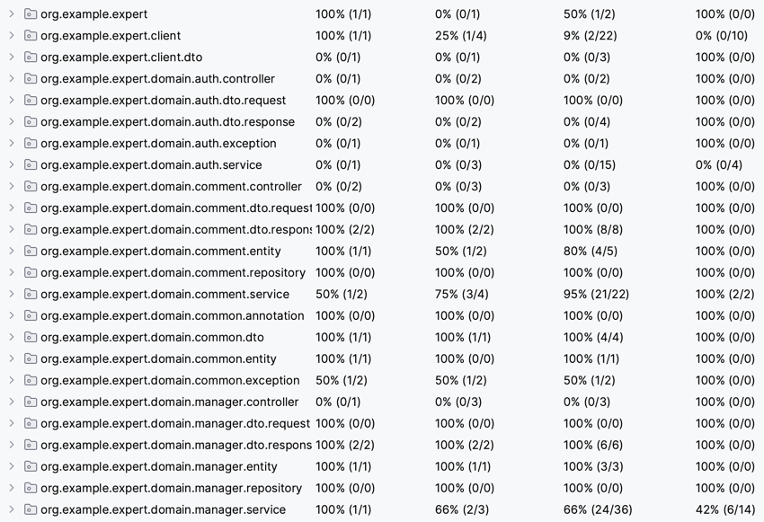
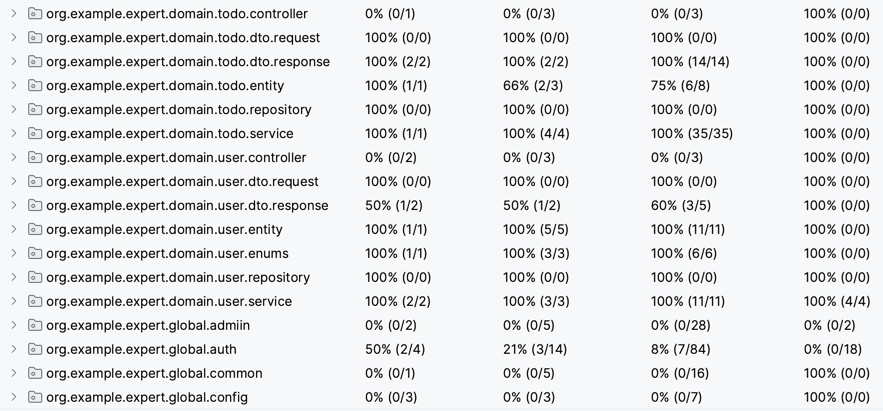
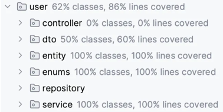
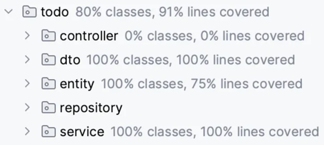
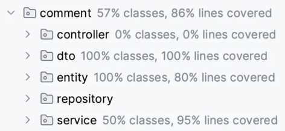
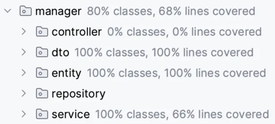

# SPRING ADVANCED
## 테스트 커버리지

**전체**

**User**

**Todo**

**Comment**

**Manager**

## 개발환경
- Framword: Spring Boot 3.4.4
- Language: Java 17
- Build: Gradle
- Database: MySQL 8.0.28
- ORM: Spring Data JPA
- Authentication: Session 기반 인증
- IDE: IntelliJ IDEA
